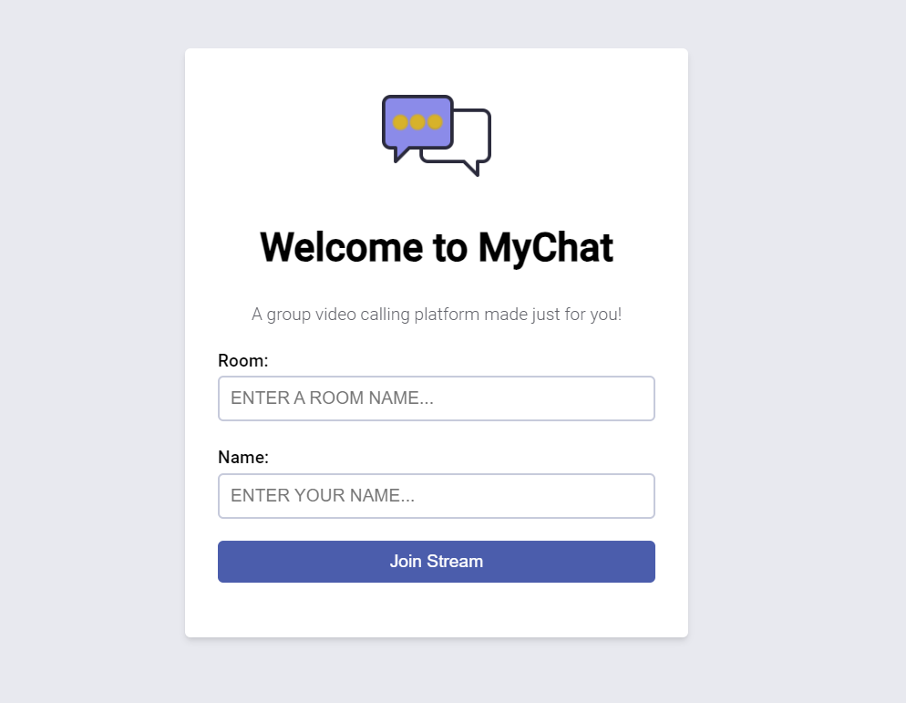

# chatapp-django-channels-realtime

## Description 
A Group video calling application using the Agora Web SDK with a Django backend.

# Steps for Run Projects

## Install Virtualenv
```
pip install virtualenv
```
## Create Virtualenv
```
virtualenv env
```
## Active Virtualenv 
```
env\Scripts\activate
```
## Install Django
```
pip install django
```
## Install Requirements
```
pip install -r requirements.txt
```
## Create Projects
```
django-admin startproject projectName
```
## Create App
```
python manage.py startapp base
```
## Run Server
```
python manage.py runserver
```
## Collect Static
```
python manage.py collectstatic
```
## Make Migrations
```
python manage.py makemigrations
```
## Show Migrations
```
python manage.py showmigrations
```
## Migrate
```
python manage.py migrate
```
## Demo
